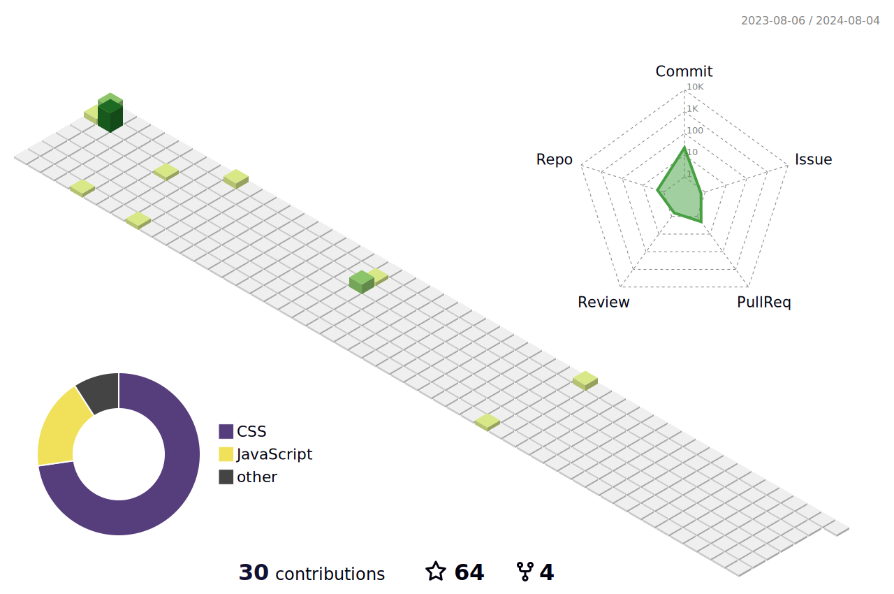

## Hey, Mason here! :wave:


I'm **Mason**.

**Languages and Frameworks**


<code></code>
<code></code>
<code></code>
<code></code>
<code></code>
<code></code>
<code></code>
<code></code>
<code></code>
<code></code>
<code></code>
<code></code>
<code></code>
<code></code>
<code></code>
<code></code>
<code></code>
<code></code>

**Tools and Environments**


<code></code>
<code></code>
<code></code>
<code></code>
<code></code>
<code></code>
<code></code>
<code></code>
<code></code>
<code></code>
<code></code>
<code></code>
<code></code>
<code></code>
<code></code>
<code></code>
<code></code>
<code></code>
<code></code>
<code></code>


总访客次数:<br>
Visitor Count:<br>

<br></br>
<table style="width:100%;margin-top:30px" style="border:none">
  <tr style="border:none">
    <th style="border:none"><a href="https://github.com/mason369">
    
    </a></th>
    <th style="border:none"><a href="https://github.com/mason369">
    
    </a></th>
  </tr>
</table>

---

#### :sparkles: [My followers](src/getTopFollowers.py)(我的粉丝)

<!--START_SECTION:top-followers-->
<table>
  <tr>
    <td align="center">
      <a href="https://github.com/gamemann">
        
      </a>
      <br />
      <a href="https://github.com/gamemann">Christian Deacon</a>
    </td>
    <td align="center">
      <a href="https://github.com/PremChapagain">
        
      </a>
      <br />
      <a href="https://github.com/PremChapagain">Prem Chapagain</a>
    </td>
    <td align="center">
      <a href="https://github.com/kenjinote">
        
      </a>
      <br />
      <a href="https://github.com/kenjinote">kenji</a>
    </td>
    <td align="center">
      <a href="https://github.com/MosFazli">
        
      </a>
      <br />
      <a href="https://github.com/MosFazli">Mostafa Fazli</a>
    </td>
    <td align="center">
      <a href="https://github.com/annie-n3">
        
      </a>
      <br />
      <a href="https://github.com/annie-n3">annie-n3</a>
    </td>
    <td align="center">
      <a href="https://github.com/JubayerRiyad">
        
      </a>
      <br />
      <a href="https://github.com/JubayerRiyad">Jubayer Riyad</a>
    </td>
    <td align="center">
      <a href="https://github.com/vjanz">
        
      </a>
      <br />
      <a href="https://github.com/vjanz">Valon Januzaj</a>
    </td>
  </tr>
  <tr>
    <td align="center">
      <a href="https://github.com/411112">
        
      </a>
      <br />
      <a href="https://github.com/411112">0x411112</a>
    </td>
    <td align="center">
      <a href="https://github.com/DGS1337">
        
      </a>
      <br />
      <a href="https://github.com/DGS1337">DouG Kalash</a>
    </td>
    <td align="center">
      <a href="https://github.com/scoobytux">
        
      </a>
      <br />
      <a href="https://github.com/scoobytux">Tu Le</a>
    </td>
    <td align="center">
      <a href="https://github.com/kulikov-dev">
        
      </a>
      <br />
      <a href="https://github.com/kulikov-dev">kulikov-dev</a>
    </td>
    <td align="center">
      <a href="https://github.com/AXG-coder">
        
      </a>
      <br />
      <a href="https://github.com/AXG-coder">Aziz falah</a>
    </td>
    <td align="center">
      <a href="https://github.com/ozboware">
        
      </a>
      <br />
      <a href="https://github.com/ozboware">ozboware</a>
    </td>
    <td align="center">
      <a href="https://github.com/H-K-R">
        
      </a>
      <br />
      <a href="https://github.com/H-K-R">Most Humayra Khanom Rime</a>
    </td>
  </tr>
  <tr>
    <td align="center">
      <a href="https://github.com/temirovazat">
        
      </a>
      <br />
      <a href="https://github.com/temirovazat">Temirov Azat</a>
    </td>
    <td align="center">
      <a href="https://github.com/neddy34">
        
      </a>
      <br />
      <a href="https://github.com/neddy34">Edward Lee</a>
    </td>
    <td align="center">
      <a href="https://github.com/richardrobertov">
        
      </a>
      <br />
      <a href="https://github.com/richardrobertov">Richard Robertov</a>
    </td>
    <td align="center">
      <a href="https://github.com/NazmusSayad">
        
      </a>
      <br />
      <a href="https://github.com/NazmusSayad">Nazmus Sayad</a>
    </td>
    <td align="center">
      <a href="https://github.com/omololevy">
        
      </a>
      <br />
      <a href="https://github.com/omololevy">Levy Omolo</a>
    </td>
    <td align="center">
      <a href="https://github.com/Gizachew29">
        
      </a>
      <br />
      <a href="https://github.com/Gizachew29">Gizachew</a>
    </td>
    <td align="center">
      <a href="https://github.com/larrymahumot">
        
      </a>
      <br />
      <a href="https://github.com/larrymahumot">Larry Bert Mahumot</a>
    </td>
  </tr>
</table>
<!--END_SECTION:top-followers-->

#### :bar_chart: [Coding time in the last month](https://github.com/muety/wakapi)(每月编码时间)

<!--START_SECTION:waka-->

```text
TypeScript       34 hrs 23 mins  🟩🟩🟩🟩🟩🟩🟩🟨⬜⬜⬜⬜⬜⬜⬜⬜⬜⬜⬜⬜⬜⬜⬜⬜⬜   29.82 %
Vue              29 hrs 10 mins  🟩🟩🟩🟩🟩🟩🟨⬜⬜⬜⬜⬜⬜⬜⬜⬜⬜⬜⬜⬜⬜⬜⬜⬜⬜   25.31 %
JavaScript       15 hrs 46 mins  🟩🟩🟩🟨⬜⬜⬜⬜⬜⬜⬜⬜⬜⬜⬜⬜⬜⬜⬜⬜⬜⬜⬜⬜⬜   13.68 %
SCSS             8 hrs 16 mins   🟩🟩⬜⬜⬜⬜⬜⬜⬜⬜⬜⬜⬜⬜⬜⬜⬜⬜⬜⬜⬜⬜⬜⬜⬜   07.17 %
YAML             7 hrs 29 mins   🟩🟨⬜⬜⬜⬜⬜⬜⬜⬜⬜⬜⬜⬜⬜⬜⬜⬜⬜⬜⬜⬜⬜⬜⬜   06.50 %
HTML             5 hrs 50 mins   🟩🟨⬜⬜⬜⬜⬜⬜⬜⬜⬜⬜⬜⬜⬜⬜⬜⬜⬜⬜⬜⬜⬜⬜⬜   05.06 %
```

<!--END_SECTION:waka-->
---



#### :star2: [Projects starred by me(我加星标的项目)](https://github.com/maguowei/starred)

[My Awesome Stars](AWESOME-STARS.md)
