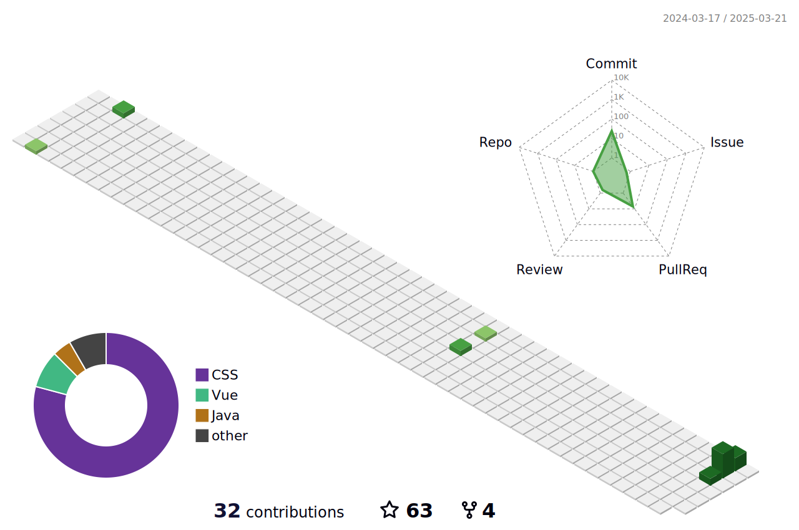

## Hey, Mason here! :wave:


I'm **Mason**.

**Languages and Frameworks**


**Tools and Environments**


<code></code>
<code></code>
<code></code>
<code></code>
<code></code>
<code></code>
<code></code>
<code></code>
<code></code>

总访客次数:<br>
Visitor Count:<br>

<br></br>
<table style="width:100%;margin-top:30px" style="border:none">
  <tr style="border:none">
    <th style="border:none"><a href="https://github.com/mason369">
    
    </a></th>
    <th style="border:none"><a href="https://github.com/mason369">
    
    </a></th>
  </tr>
</table>

---

#### :sparkles: [My followers](src/getTopFollowers.py)(我的粉丝)

<!--START_SECTION:top-followers-->
<table>
  <tr>
    <td align="center">
      <a href="https://github.com/gamemann">
        
      </a>
      <br />
      <a href="https://github.com/gamemann">Christian Deacon</a>
    </td>
    <td align="center">
      <a href="https://github.com/peter-kimanzi">
        
      </a>
      <br />
      <a href="https://github.com/peter-kimanzi">Peter Kimanzi</a>
    </td>
    <td align="center">
      <a href="https://github.com/kenjinote">
        
      </a>
      <br />
      <a href="https://github.com/kenjinote">kenji</a>
    </td>
    <td align="center">
      <a href="https://github.com/MosFazli">
        
      </a>
      <br />
      <a href="https://github.com/MosFazli">Mostafa Fazli</a>
    </td>
    <td align="center">
      <a href="https://github.com/Kwynto">
        
      </a>
      <br />
      <a href="https://github.com/Kwynto">Constantine Zavezeon</a>
    </td>
    <td align="center">
      <a href="https://github.com/kulikov-dev">
        
      </a>
      <br />
      <a href="https://github.com/kulikov-dev">kulikov-dev</a>
    </td>
    <td align="center">
      <a href="https://github.com/H-K-R">
        
      </a>
      <br />
      <a href="https://github.com/H-K-R">Most Humayra Khanom</a>
    </td>
  </tr>
  <tr>
    <td align="center">
      <a href="https://github.com/AXG-coder">
        
      </a>
      <br />
      <a href="https://github.com/AXG-coder">Aziz falah</a>
    </td>
    <td align="center">
      <a href="https://github.com/Sen-Takatsuki">
        
      </a>
      <br />
      <a href="https://github.com/Sen-Takatsuki">高槻 泉</a>
    </td>
    <td align="center">
      <a href="https://github.com/CarthikYes">
        
      </a>
      <br />
      <a href="https://github.com/CarthikYes">Karthik S ✔️</a>
    </td>
    <td align="center">
      <a href="https://github.com/OmarUTEC">
        
      </a>
      <br />
      <a href="https://github.com/OmarUTEC">Om@r</a>
    </td>
    <td align="center">
      <a href="https://github.com/MaheenMohid">
        
      </a>
      <br />
      <a href="https://github.com/MaheenMohid">Maheen Mohiuddin</a>
    </td>
    <td align="center">
      <a href="https://github.com/lucasamorimd">
        
      </a>
      <br />
      <a href="https://github.com/lucasamorimd">Lucas Amorim</a>
    </td>
    <td align="center">
      <a href="https://github.com/Tianscar">
        
      </a>
      <br />
      <a href="https://github.com/Tianscar">碳酸天剑</a>
    </td>
  </tr>
  <tr>
    <td align="center">
      <a href="https://github.com/zhanghao5683934">
        
      </a>
      <br />
      <a href="https://github.com/zhanghao5683934">zhanghao5683934</a>
    </td>
    <td align="center">
      <a href="https://github.com/LingASDJ">
        
      </a>
      <br />
      <a href="https://github.com/LingASDJ">JDSA Ling</a>
    </td>
    <td align="center">
      <a href="https://github.com/zlx1134558955">
        
      </a>
      <br />
      <a href="https://github.com/zlx1134558955">zlx1134558955</a>
    </td>
    <td align="center">
      <a href="https://github.com/tonyandeverything">
        
      </a>
      <br />
      <a href="https://github.com/tonyandeverything">ThemeTony</a>
    </td>
    <td align="center">
      <a href="https://github.com/renqian805">
        
      </a>
      <br />
      <a href="https://github.com/renqian805">renqian805</a>
    </td>
    <td align="center">
      <a href="https://github.com/HonnaMeiko">
        
      </a>
      <br />
      <a href="https://github.com/HonnaMeiko">HonnaMeiko</a>
    </td>
    <td align="center">
      <a href="https://github.com/nihaoa19">
        
      </a>
      <br />
      <a href="https://github.com/nihaoa19">nihaoa19</a>
    </td>
  </tr>
</table>
<!--END_SECTION:top-followers-->

#### :bar_chart: [Coding time in the last month](https://github.com/muety/wakapi)(每月编码时间)

<!--START_SECTION:waka-->

```text
Vue              13 hrs 35 mins  🟩🟩🟩🟩🟩🟩🟩⬜⬜⬜⬜⬜⬜⬜⬜⬜⬜⬜⬜⬜⬜⬜⬜⬜⬜   28.90 %
SCSS             7 hrs 55 mins   🟩🟩🟩🟩⬜⬜⬜⬜⬜⬜⬜⬜⬜⬜⬜⬜⬜⬜⬜⬜⬜⬜⬜⬜⬜   16.85 %
Markdown         7 hrs 30 mins   🟩🟩🟩🟩⬜⬜⬜⬜⬜⬜⬜⬜⬜⬜⬜⬜⬜⬜⬜⬜⬜⬜⬜⬜⬜   15.95 %
HTML             7 hrs 23 mins   🟩🟩🟩🟩⬜⬜⬜⬜⬜⬜⬜⬜⬜⬜⬜⬜⬜⬜⬜⬜⬜⬜⬜⬜⬜   15.72 %
JavaScript       6 hrs 0 mins    🟩🟩🟩⬜⬜⬜⬜⬜⬜⬜⬜⬜⬜⬜⬜⬜⬜⬜⬜⬜⬜⬜⬜⬜⬜   12.78 %
JSON             1 hrs 42 mins   🟩⬜⬜⬜⬜⬜⬜⬜⬜⬜⬜⬜⬜⬜⬜⬜⬜⬜⬜⬜⬜⬜⬜⬜⬜   03.63 %
```

<!--END_SECTION:waka-->
---



#### :star2: [Projects starred by me(我加星标的项目)](https://github.com/maguowei/starred)

[My Awesome Stars](AWESOME-STARS.md)
